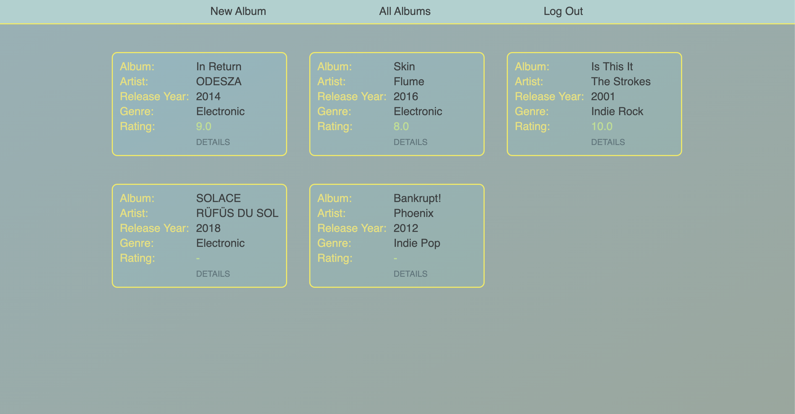

# Music Rank
SEI Project 02

Trello: https://trello.com/b/wXkEgNV0/sei-project-2
App Link: https://music-rank.herokuapp.com/
## App Description
A music rating application. Add albums and contribute ratings.

## Screenshots

## Technologies Used
* CSS
* HTML
* JavaScript
* NodeJS
* ExpressJS
* MongoDB
* MongooseJS ODM
* OAuth

## Next Steps

Enhancements that can be made:
* Search bar functionality to search for albums
* Ability to filter and order albums 
* API for music instead of user input
* Album artwork
* Profile pages
